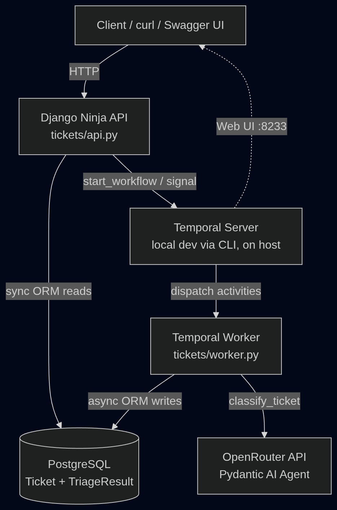
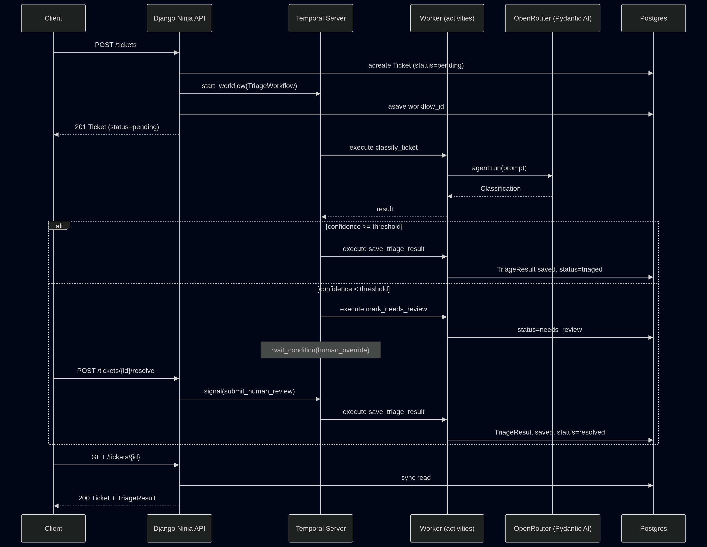

# Ticket Triage System

A support-ticket triage backend that uses an LLM (via Pydantic AI + OpenRouter) to auto-classify incoming tickets, orchestrated through Temporal so that low-confidence classifications pause for human review instead of guessing.

## Overview

A customer-facing ticket comes in via `POST /tickets`. A Temporal workflow classifies it using an LLM. If the model is confident, the ticket is auto-triaged. If it isn't, the ticket is parked in `needs_review` and the
workflow waits — indefinitely, via a signal — for a human to resolve it through `POST /tickets/{id}/resolve`.

The system is deliberately split into three processes that don't share memory: the API (handles HTTP, starts/signals workflows, never blocks on LLM calls), the Temporal server (durable orchestration state), and a worker
(runs activities — the actual DB writes and the LLM call). 

## Architecture



### Ticket lifecycle



### What's containerized

| Component | How it runs | Why |
|---|---|---|
| Postgres | Docker Compose | Infra this repo owns — trivial to containerize, no reason not to. |
| Django API + Temporal worker | Docker Compose (`backend` / `worker` services, same image) | Containerized so the whole app stack starts with one command. |
| Temporal server | Native, via `temporal server start-dev` | Not infra this repo owns |

## How to Run

You need **two terminals**.

### 1. Temporal dev server (Terminal 1)

```bash
brew install temporal   # macOS; see https://docs.temporal.io/cli for other platforms
temporal server start-dev
```

This exposes the gRPC endpoint on `localhost:7233` and a Web UI at `http://localhost:8233` — useful for watching workflow executions live while you test. This process has to be running *before* you start the containers below, since both the API and the worker connect to it on startup.

### 2. Everything else (Terminal 2)

```bash
cp backend/.env.example backend/.env   # fill in a real OPENROUTER_API_KEY
docker compose up --build
``` 

This single command starts Postgres, runs Django migrations, and starts both the API and the Temporal worker. Containers reach the Temporal server on your host via `host.docker.internal` — configured in `docker-compose.yml`,
nothing to set up manually.

Watch the combined logs — you should see the worker print `Worker started, polling task queue 'triage-queue'...` alongside Django's `Starting development server at http://0.0.0.0:8000/`. API is now live at `http://localhost:8000`; interactive docs at `http://localhost:8000/api/docs`.

<details>
<summary>Running natively instead of via Docker (optional)</summary>

```bash
# Terminal 1
temporal server start-dev

# Terminal 2
docker compose up -d postgres   # just the DB
python -m venv venv && source venv/bin/activate
pip install -r requirements.txt
python manage.py migrate
python manage.py runserver

# Terminal 3
source venv/bin/activate
python tickets/worker.py
```

`TEMPORAL_ADDRESS` defaults to `localhost:7233`, so no env changes are needed for this path — it's only overridden to `host.docker.internal:7233` inside `docker-compose.yml` for the containerized `backend`/`worker` services.
</details>

### End-to-end smoke test

**Auto-triage (clearly billing-related, high confidence expected):**

```bash
curl -X POST http://localhost:8000/api/tickets \
  -H "Content-Type: application/json" \
  -d '{"subject":"Charged twice for my subscription","body":"I was billed $49.99 twice this month for the same plan. Please refund the duplicate charge.","customer_email":"a@b.com"}'
```

Copy the returned `id`, then poll:

```bash
curl http://localhost:8000/api/tickets/<id>
```

Status should settle at `triaged` with a populated `triage_result` within a couple seconds.

**Needs-review path (ambiguous, low confidence expected):**

```bash
curl -X POST http://localhost:8000/api/tickets \
  -H "Content-Type: application/json" \
  -d '{"subject":"question","body":"idk something is weird with my account maybe? not sure what to do","customer_email":"a@b.com"}'
```

Poll it — status should settle at `needs_review`. Then resolve it as a human reviewer:

```bash
curl -X POST http://localhost:8000/api/tickets/<id>/resolve \
  -H "Content-Type: application/json" \
  -d '{"category":"account","priority":"low"}'
```

Poll once more — status should now be `resolved`, with `triage_result.reviewed_by_human: true` and `confidence: 1.0`.

Watch both flows in the Temporal Web UI at `http://localhost:8233` — you should see the `classify_ticket` → `save_triage_result` path for the first, and `classify_ticket` → `mark_needs_review` → (pause) → `save_triage_result`
for the second.

> Small free-tier LLMs can be inconsistent about self-reported confidence.
> If a ticket you expect to be ambiguous still auto-triages, either try more
> clearly ambiguous wording or temporarily raise `CONFIDENCE_THRESHOLD` in
> `tickets/workflows.py` and re-run `docker compose up --build`.

## How to Test

Tests run natively (not in Docker), against a live Postgres:

```bash
docker compose up -d postgres   # pytest-django needs Postgres to create/drop a test DB
source venv/bin/activate
pytest
```

No live Temporal server and no `OPENROUTER_API_KEY` are required to run thesuite:

- `tests/test_api.py` mocks the Temporal client for ticket creation, so no workflow is actually started.
- `tests/test_activities.py` overrides the Pydantic AI agent with `TestModel` / `FunctionModel`, so no real OpenRouter call is made.
- `tests/test_workflows.py` uses Temporal's time-skipping test environment (`temporalio.testing.WorkflowEnvironment`), an in-process test server — not `temporal server start-dev` — with stub activities standing in for the real ones.

The Postgres user needs `CREATEDB` privileges for pytest-django to manage the test database; the default `postgres` superuser from `docker-compose.yml` already has this.

## API Reference

All endpoints are mounted under `/api`. Interactive docs (and a way to try requests without curl) live at `/api/docs`.

| Method & Path | Sync/Async | Description |
|---|---|---|
| `POST /tickets` | **async** | Creates a `Ticket` (status `pending`) and starts a `TriageWorkflow`. |
| `GET /tickets/{id}` | sync | Fetches a ticket, including `triage_result` if one exists. |
| `GET /tickets?status=&limit=&offset=` | sync | Lists tickets with optional status filter and limit/offset pagination (default limit 20). |
| `POST /tickets/{id}/resolve` | **async** | Signals a workflow paused in `needs_review` with a human-submitted category/priority. |
